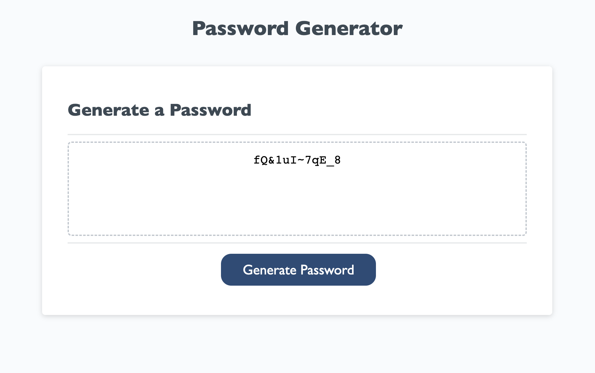

# Password Generator

## Description

This project is a random password generator based off some source code provided by my softare development bootcamp. On loading the page, the user will be prompted to enter the amount of characters they'd like in their password, then select whether they want to include lowercase letters, uppercase letters, numbers, and symbols in their password. After answering the prompts, the page will generate and display a random password on clicking the "generate password" button. This project also contains validation code to ensure the password is between 8 and 128 characters, and to ensure that at least one character type is chosen. 

## Installation
Click the link below to go to my github repo, then clone it to your machine. 

https://github.com/whitbreezy/password-generator

## Usage

Below is an example of a random password generated. It is 12 characters long, and includes lowercase letters, uppercase letters, numbers, and symbols.

## License

See license information in repo.

